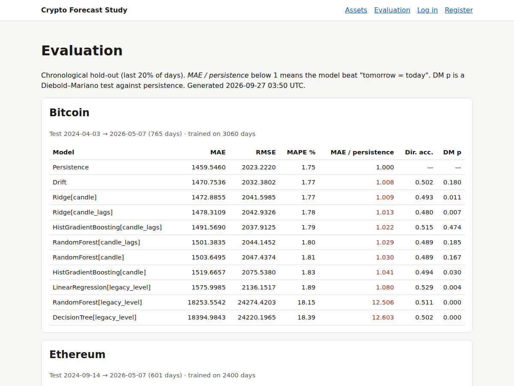
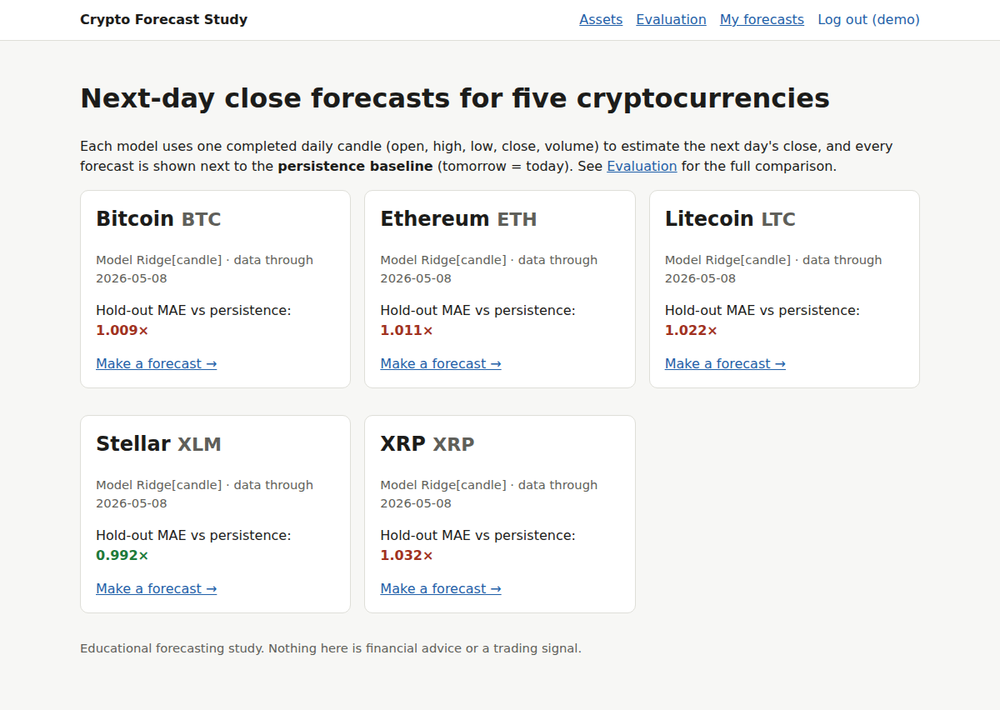
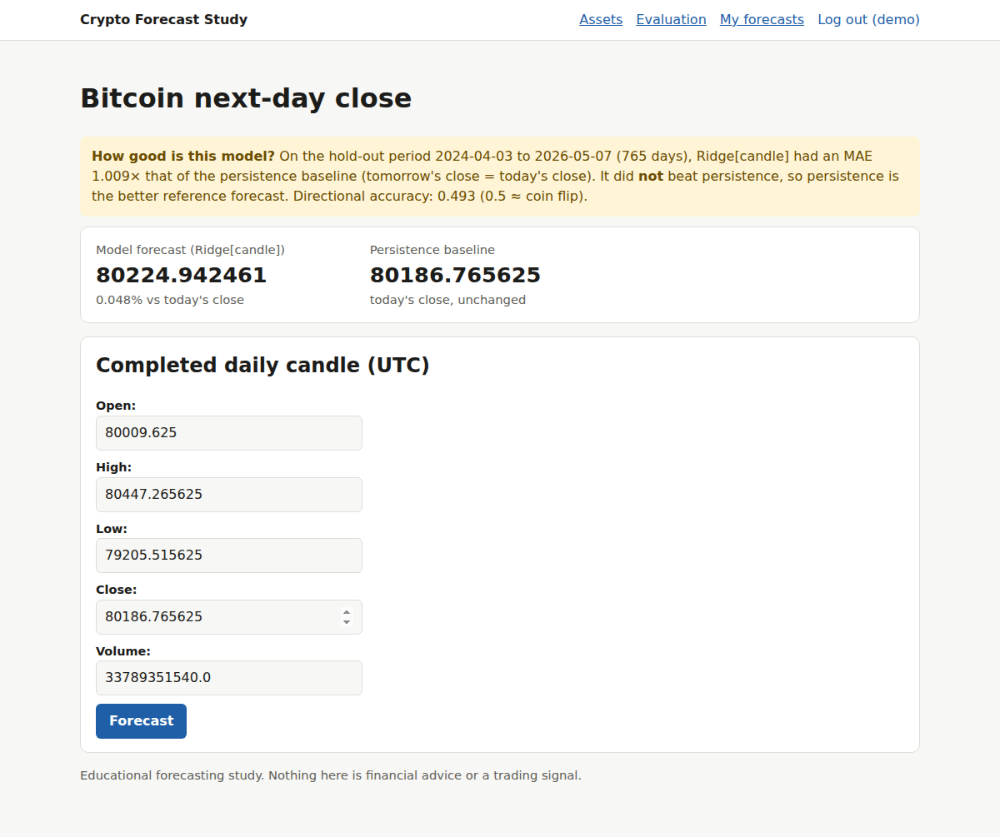

# Crypto Price Prediction — an honest next-day forecasting study

[](https://github.com/Aakashnaidum/crypto-price-prediction/actions/workflows/ci.yml)

An educational study of **one-day-ahead closing-price forecasts** for Bitcoin, Ethereum, Litecoin,
Stellar and XRP, with a small Django web app that shows each model's forecast **next to the
persistence baseline** ("tomorrow's close = today's close") and the evidence for how the two compare.

**Main finding (re-run on 2026-09-27):** on a chronological hold-out of roughly two years, no learned
model reliably beats persistence. The best learned model is within about ±3% of persistence MAE for every asset;
it is slightly better only for Stellar (0.992×), and that gap is not statistically significant
(Diebold–Mariano p = 0.31). This is consistent with daily crypto closes behaving close to a random walk.

> This is not a trading tool. No output here is financial advice, and no trading performance is claimed.



## Where this project came from, and what changed

| | |
|---|---|
| **Original base (third party)** | An academic mini-project package obtained from an external project provider: Jupyter notebooks (EDA, DecisionTree/LinearRegression/RandomForest regressors), a Django app with per-coin pages, and a generic report. I did not write that original code, and it is not reproduced in this repository. |
| **Earlier revision** | Added Ethereum/XRP, refreshed data (Kaggle + Yahoo Finance), switched to a next-day target with a chronological split, and added a persistence comparison. That revision's saved summary is kept in [`results/legacy/`](results/legacy/). |
| **This repository** | Rewritten as a tested Python package plus a rebuilt web app (details below). |

### Problems found in the original setup

1. **Target leakage + shuffled split.** The notebooks predicted *the same day's* close from that day's High, Low and Open
   (the close always lies between Low and High) using a random `train_test_split`. Re-running that protocol gives
   R² ≈ 0.999 for Bitcoin. That score reflects the leakage, not any ability to forecast.
2. **Wrong metric.** `rand_score` (a clustering agreement index) was reported as "accuracy" for a regression model.
3. **Level-space trees.** Tree models predicting price *levels* cannot output prices above the training maximum, so they
   fail when a test period reaches new highs (Bitcoin RandomForest hold-out MAE is 12.5× persistence).
4. **Silent date gaps.** The Kaggle portion has 107 gaps (212 missing days, 2019–2022). "Next row" was treated as
   "next day", so some targets were 2–7 days ahead.
5. **App/evaluation mismatch.** The app showed BUY/SELL "day-trading signals" from a model that had not beaten
   persistence. Its manual-entry path also used the day's *open* as the "persistence" price.
6. **Incomplete last candle.** The refresh script appended the current UTC day before it had closed (the 2026-05-10 row).
7. **Publication hygiene.** The original package had a committed SQLite database with user accounts, a hard-coded Google Maps API key
   in the templates, a team page with third parties' names and e-mails, a 319 MB virtualenv, and absolute local paths.

### What I changed

- **Leakage-safe features and targets** ([`cryptoforecast/features.py`](cryptoforecast/features.py)): the series is
  re-indexed to calendar days. Row *t* uses only information available by the close of day *t*. The target is the close of
  day *t+1*, and rows are dropped where that day is missing. Returns are never computed across gaps. A unit test mutates
  future prices and checks that no past feature changes.
- **Return-space models:** Ridge, RandomForest and HistGradientBoosting predict the next-day log return, which is then
  converted back to a price. They use two feature sets: a single candle (`candle`) and a candle plus short return and volatility history (`candle_lags`).
  The original level-space models are kept for comparison (`legacy_level`).
- **Baselines and statistics:** persistence and drift baselines; MAE, RMSE, MAPE, MAE relative to persistence, and
  directional accuracy. Days with no predicted move are excluded, so persistence has no directional accuracy. The Diebold–Mariano test with the
  Harvey small-sample correction checks whether differences are significant. A 5-fold expanding-window walk-forward serves as a robustness check.
- **No test-set model selection:** the deployed model is chosen on a validation split *inside* the training block and
  is only then scored on the hold-out.
- **App consistent with the evaluation:** each saved model bundle stores its estimator, feature list, target definition, training
  date range and hold-out evidence. The app computes features with the same function as training (a test checks that
  the two paths give identical predictions), always shows persistence alongside the model, and has no BUY/SELL signals.
- **Rebuilt Django app:** one parameterised view for all assets, form validation (OHLC consistency), per-user forecast
  history behind login, secrets and paths from environment variables, and optional live pre-fill from Yahoo Finance that skips the
  unfinished current-day candle.
- **Reproducibility:** pinned requirements, a data-rebuild script, a script that re-derives the saved legacy summary,
  and CI (ruff, pytest, Django tests, migration check) that runs on synthetic data.

## Results

Chronological hold-out = the last 20% of usable days per asset (usable = the richest feature set is defined). All
models are scored on the same days. Full tables: [`results/RESULTS.md`](results/RESULTS.md); raw numbers:
[`results/metrics.json`](results/metrics.json).

| Asset | Test period (days) | Persistence MAE (USD) | Best learned model | MAE / persistence | DM p-value | Walk-forward folds won |
|---|---|---:|---|---:|---:|---:|
| Bitcoin | 2024-04-03 → 2026-05-07 (765) | 1460 | Ridge[candle] | 1.009 | 0.01 (worse) | 1/5 |
| Ethereum | 2024-09-14 → 2026-05-07 (601) | 76.4 | Ridge[candle] | 1.011 | 0.10 | 0/5 |
| Litecoin | 2024-04-03 → 2026-05-07 (765) | 2.365 | Ridge[candle] | 1.022 | 0.02 (worse) | 1/5 |
| Stellar | 2024-07-03 → 2026-05-07 (674) | 0.008684 | Ridge[candle] | 0.992 | 0.31 | 3/5 |
| XRP | 2024-04-21 → 2026-05-07 (747) | 0.0516 | Ridge[candle] | 1.032 | 0.03 (worse) | 0/5 |

"(worse)" marks cases where the model's squared errors are significantly *larger* than persistence's at the 5% level. Directional accuracy of
all learned models on the hold-out is 0.46–0.54, which is indistinguishable from a coin flip.

**Verification of the saved historical summary.** `scripts/verify_saved_summary.py` repeats the earlier revision's
protocol on the same CSVs. All 20 saved hold-out RMSE values (5 assets × 3 models + persistence) are reproduced to
within 0.05%; the small RandomForest differences come from library versions. That confirms the saved claim that
persistence beats every learned model for all five currencies under that protocol ([`results/legacy/verification.json`](results/legacy/verification.json)).

What is re-run vs. saved:
- `results/metrics.json`, `results/RESULTS.md` and `models/*.joblib` were **re-run** in this repository on the data described below.
- `results/legacy/training_summary.json` is the **saved** output of the earlier revision (absolute paths removed).

## Architecture

```
cryptoforecast/        library: data loading/validation, features, models, evaluation, model bundles
scripts/
  build_dataset.py     rebuild data/*.csv from Kaggle + Yahoo Finance
  run_experiments.py   full study -> results/metrics.json, results/RESULTS.md
  train_models.py      select on validation, score on hold-out, refit, save models/<asset>.joblib
  verify_saved_summary.py  reproduce the legacy summary
webapp/                Django project (config/) and app (forecasts/)
tests/                 pytest suite (synthetic data)
```

## Setup

Requires Python 3.11.

```bash
python -m venv .venv && source .venv/bin/activate
pip install -r requirements-dev.txt        # or requirements.txt for the minimum
```

### Run the web app (uses the committed models)

```bash
cd webapp
export DJANGO_DEBUG=true                   # local development only; see .env.example
python manage.py migrate
python manage.py runserver
```

Open http://127.0.0.1:8000, choose an asset and enter a completed daily candle. To pre-fill the form from Yahoo Finance, set
`CRYPTO_ENABLE_LIVE_DATA=true` (requires `yfinance` and network access).

### Reproduce the study

The price CSVs are not redistributed (see [`data/README.md`](data/README.md)). After placing or rebuilding them in `data/`:

```bash
python scripts/run_experiments.py          # ~2 minutes on a laptop
python scripts/train_models.py
python scripts/verify_saved_summary.py
```

### Tests

```bash
pytest -q                                              # 18 library tests
cd webapp && DJANGO_DEBUG=true python manage.py test forecasts   # 7 web tests
```

The tests cover: next-calendar-day targets; no use of future data; gap handling; data validation; that split and
walk-forward folds train only on the past; metric and Diebold–Mariano sanity checks; that a model recovers an injected
signal and beats persistence; identical predictions from the app and training paths; rejection of invalid candles; and web flows
(forecast display, input validation, 404/503, login-only per-user history, registration).

## Screenshots

These are captured from the running app, using the real Bitcoin candle for 2026-05-08 from the dataset.

| Assets | Forecast |
|---|---|
|  |  |

## Limitations

- **Data splice:** Kaggle rows (to 2022-10-23) are joined to Yahoo Finance rows. These are different aggregators, so there
  may be small level differences at the boundary. All hold-out periods lie within the Yahoo segment.
- **Early volume:** volume is zero for the first ~236 Bitcoin/Litecoin days, and one XRP row violates OHLC consistency.
- **Scope:** only daily horizons, OHLCV inputs, and small tabular models. No order-book, on-chain or sentiment features, and
  no transaction-cost-aware evaluation. These results say nothing about trading profitability.
- **Stability:** metrics depend on the chosen period. The walk-forward folds show the relative ranking is stable, but
  absolute errors vary strongly with volatility regimes.
- **Serving:** model bundles are pickle-based (joblib), so only load bundles you trained yourself. The app is a local demo, not
  a hardened deployment.

## Contributions

Base project: third-party academic project package (see above). Revisions and this repository: Aakash Naidu.
The redesign, evaluation code, tests and documentation in this repository were prepared with AI assistance (Claude).

No open-source license is granted, because redistribution rights for the original base could not be established.
The code is published for viewing and portfolio purposes only.
